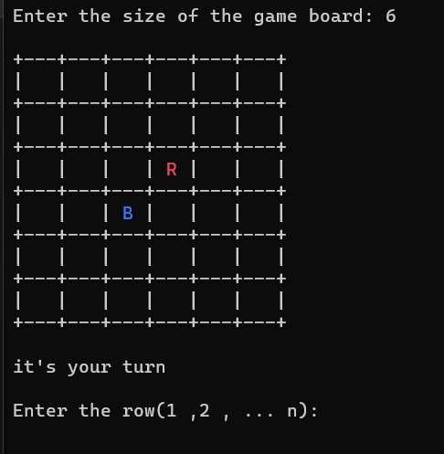
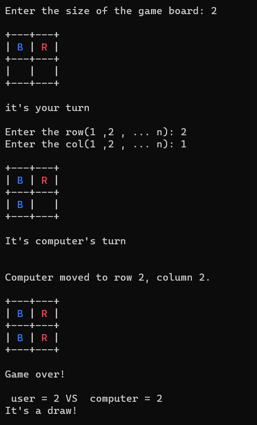
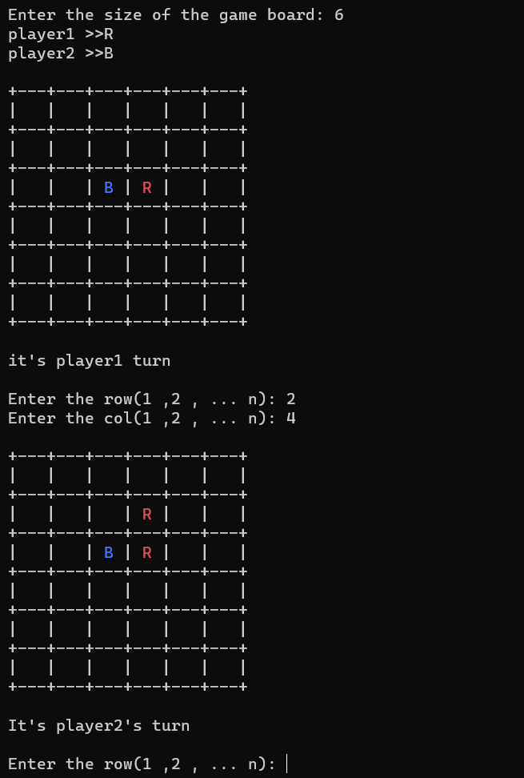

## دی 1402
# Ai : Land capture game 

- We have a game board, the first marker of each automatic player is in the middle of the board. In this written code, the first player is the user and the second player is the computer, which automatically plays with the user with the min-max algorithm that we have written. Our algorithm must be intelligent so that the computer does not lose to the user.

- Game environment :
;

;

- Two-user version :
;
